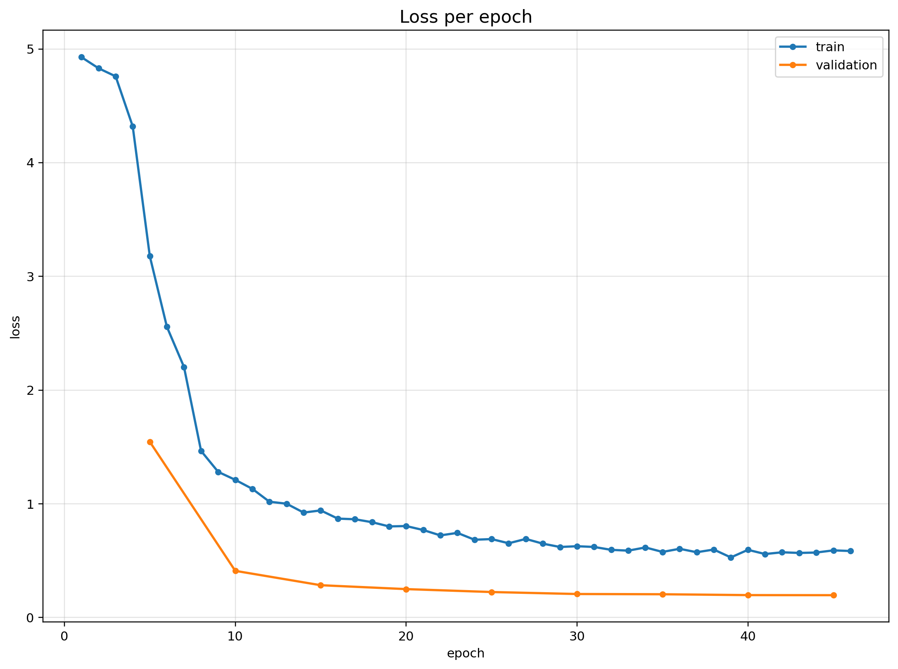
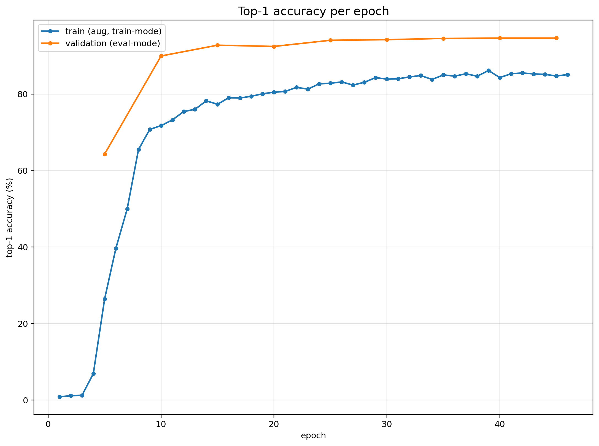
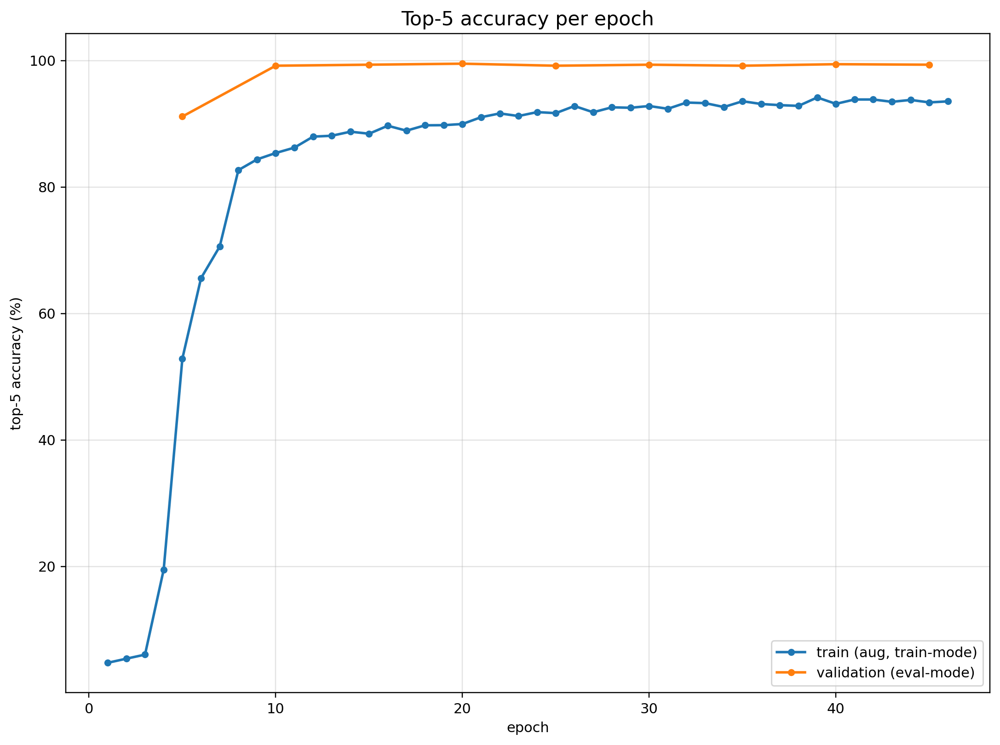
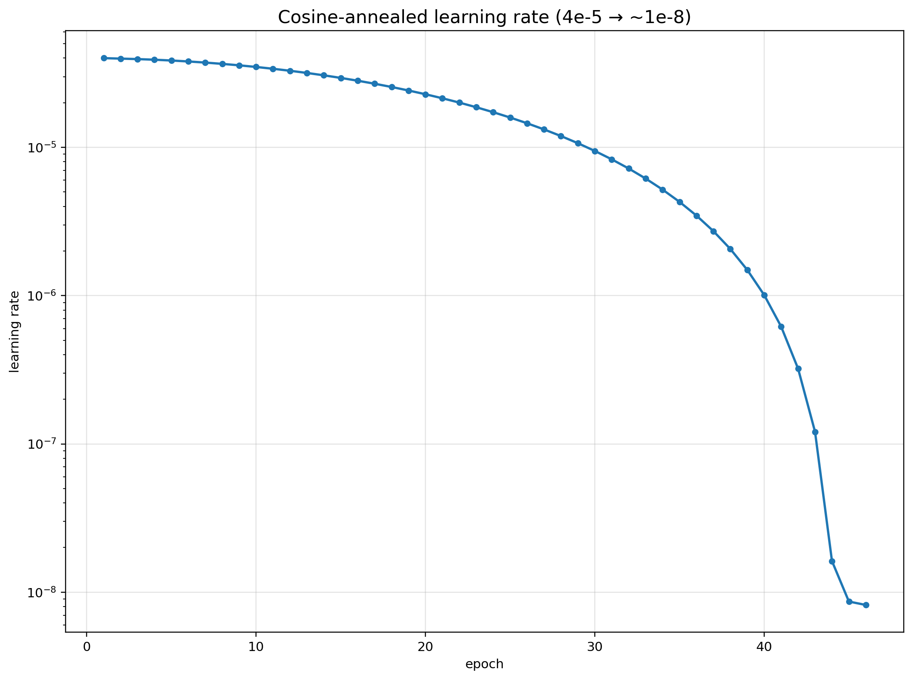
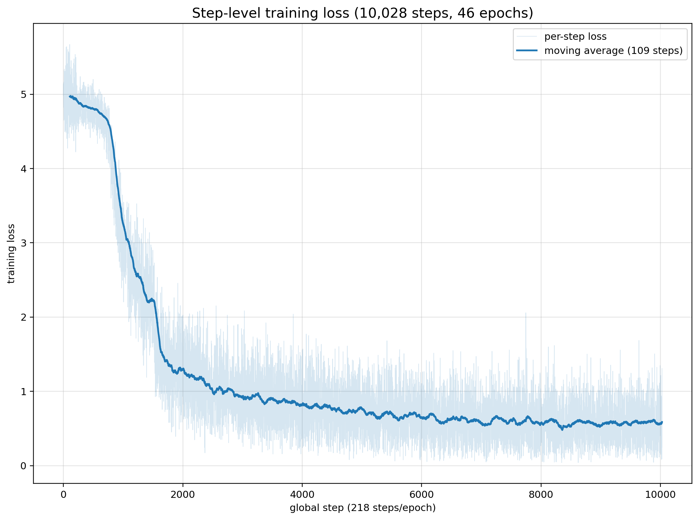
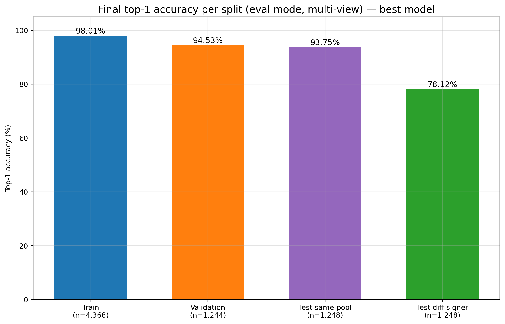
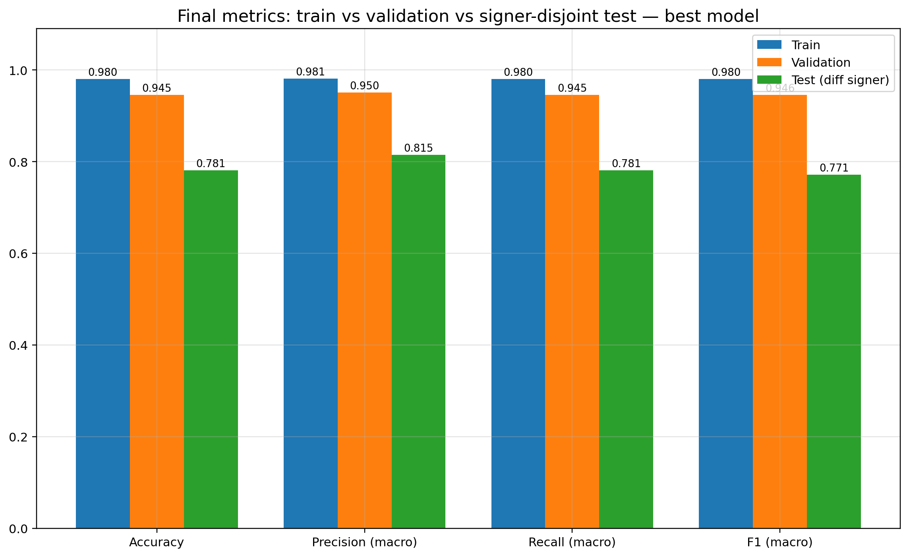
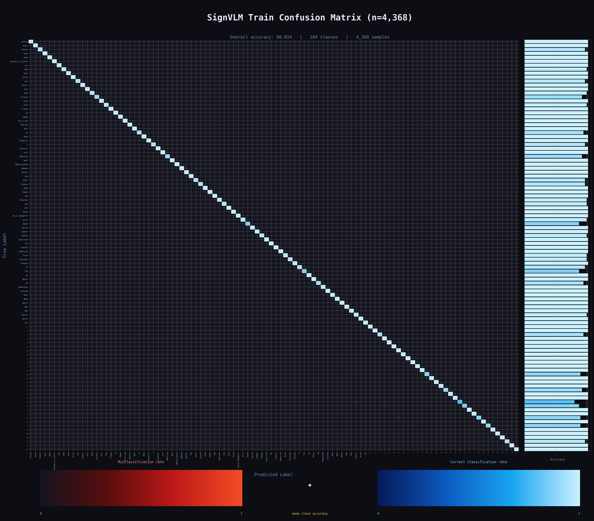
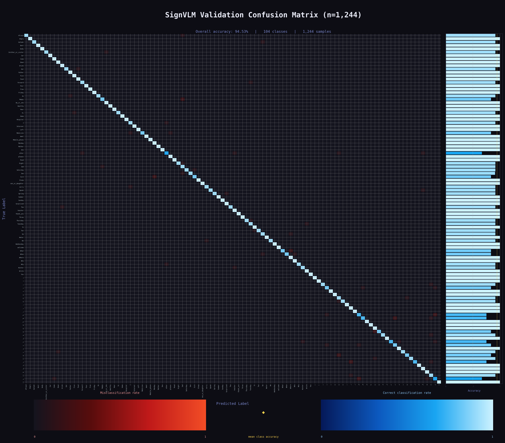
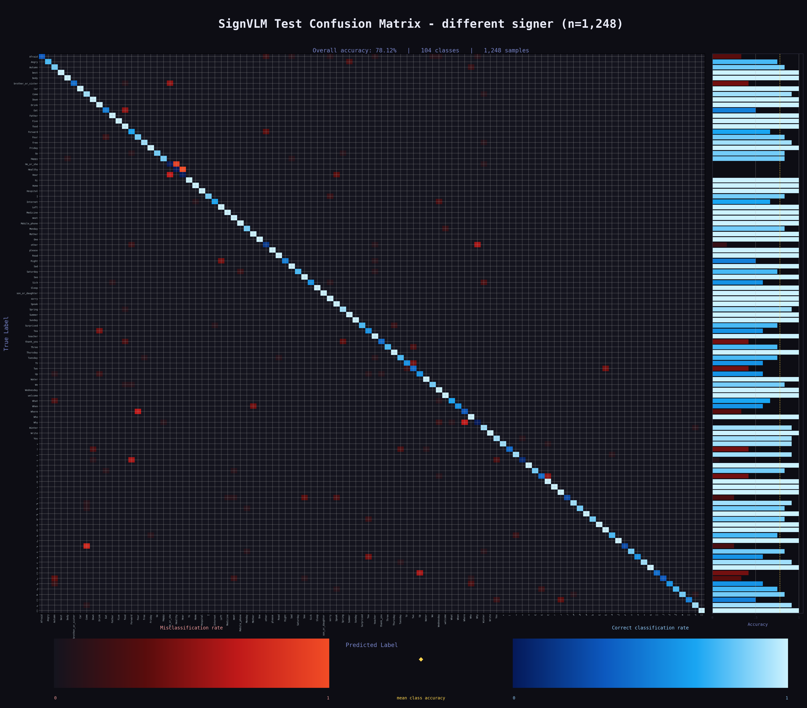

# PSL Recognition — SignVLM Signer-Disjoint Finetune Report

**Run:** `signVLM_lists` artifacts | 46 epochs | Best checkpoint: epoch 45 (val loss 0.1967, val acc 94.61%*)

*\*In-training validation pass (per-epoch table, §2). The independent post-training re-evaluation of this same
checkpoint (Final metrics, §2) measures 94.53% — see protocol note below.*

All numbers, curves, and confusion matrices below are reconstructed directly from the logged artifacts in
[docs/retrain_details/signVLM_lists/](../signVLM_lists/) (`signvlm_loss_history.json`, `signvlm_step_log.csv`,
`signvlm_final_metrics.csv`, `signvlm_full_metrics_test.csv`, `*_confusion_matrix.npy`).
Regenerate every figure with [generate_report_assets.py](generate_report_assets.py).

---

## 1. Model architecture

**SignVLM** — frozen CLIP image backbone + lightweight EVL-style temporal decoder + linear classifier.

| Stage | Layer | Notes |
|---|---|---|
| backbone | CLIP ViT-L/14 (lnpre variant), **frozen** | per-frame visual features, 224×224 input |
| temporal decoder | 4 transformer decoder layers, qkv_dim 1024, 16 attention heads | EVL-style, attends across frames |
| head | Linear → 104 logits | PSL-104 classifier |

**Input:** 16–24 frames/clip, 224×224, RGB. **Classes:** 104 (PSL-104 — English gloss words + Urdu alphabet letters; `label_map_auto.json`).

For reference, the base SignVLM architecture (Luqman, 2025, *PeerJ Comput. Sci.* 11:e3112) reports **58.6 M trainable
parameters in the EVL-style temporal decoder + classification head** — the CLIP backbone is frozen and contributes 0
trainable parameters, so it is not part of that count. No parameter-count snapshot was captured for this specific
PSL-104 run.

### Training recipe

| Setting | Value | Source |
|---|---|---|
| Train / Val / Test split | 4,368 / 1,244 / 1,248 clips | `train.tsv` / `val.tsv` / `test.tsv` (`unseen.tsv` empty, not evaluated) |
| Test protocol | signer-disjoint (held-out signer), n=1,248 | `signvlm_full_metrics_test.csv` (`test_diff_signer`) |
| Batch size | 20 (inferred: 218 steps/epoch × 20 ≈ 4,368 with drop_last) | `signvlm_step_log.csv` |
| Optimizer | AdamW | training log |
| Learning rate | 4e-5 initial, cosine-annealed to ~1e-8 | `signvlm_loss_history.json` |
| Scheduler | CosineAnnealingLR (T_max = num_steps) | training log |
| Loss | CrossEntropyLoss | training log |
| Weight decay | 0.05 (project default, not confirmed in this run's logs) | project scripts |
| Epochs completed | 46 (global_step 0–10,027, 218 steps/epoch) | `signvlm_step_log.csv` |
| Checkpointing | best-val-loss checkpoint saved at the every-5-epoch evals (epochs 5, 10, …, 45) | training log |

**Key protocol notes**

- **Train accuracy is train-mode / augmented** (`Acc1(aug)`), so it *understates* the model's true fit — final eval-mode
  train accuracy is 98.01% vs. the ~85% seen in the curves.
- **Validation ran every 5th epoch** (epochs 5, 10, …, 45) — the val curves below have points only at those epochs.
- **Final metrics are eval-mode, multi-view** for train/val (`signvlm_final_metrics.csv`).
- **The epoch-45 val acc in the per-epoch table (94.61%) and the Final-metrics val acc (94.53%) are both multi-view
  eval on the same best checkpoint, run as two independent passes** — one logged live inside the training loop, one
  re-run afterward by a separate script. Multi-view eval samples frames with a random component not pinned to a fixed
  seed across runs, so the two passes disagree by exactly 1 of 1,244 clips (1,177 vs. 1,176 correct). This is evaluation-pass
  noise, not a train/eval-mode mismatch or a copy-paste error, and it is well within run-to-run variance for a sample
  this size.
- The test split is the **same 104 classes performed by a signer never seen in training** (signer-disjoint protocol).

---

## 2. Per-epoch metrics

| epoch | lr | train_loss | train_acc1 | train_acc5 | val_loss | val_acc1 | val_acc5 |
|---|---|---|---|---|---|---|---|
| 1 | 4.00e-05 | 4.9275 | 0.87% | 4.76% |  |  |  |
| 2 | 3.97e-05 | 4.8302 | 1.15% | 5.41% |  |  |  |
| 3 | 3.94e-05 | 4.7591 | 1.26% | 6.06% |  |  |  |
| 4 | 3.90e-05 | 4.3192 | 6.90% | 19.50% |  |  |  |
| 5 | 3.85e-05 | 3.1776 | 26.42% | 52.87% | 1.5456 | 64.31% | 91.16% |
| 6 | 3.80e-05 | 2.5564 | 39.70% | 65.60% |  |  |  |
| 7 | 3.73e-05 | 2.2036 | 49.98% | 70.60% |  |  |  |
| 8 | 3.66e-05 | 1.4651 | 65.48% | 82.68% |  |  |  |
| 9 | 3.58e-05 | 1.2812 | 70.76% | 84.38% |  |  |  |
| 10 | 3.49e-05 | 1.2110 | 71.74% | 85.39% | 0.4107 | 89.95% | 99.20% |
| 11 | 3.39e-05 | 1.1317 | 73.23% | 86.24% |  |  |  |
| 12 | 3.29e-05 | 1.0185 | 75.41% | 87.98% |  |  |  |
| 13 | 3.18e-05 | 1.0011 | 76.01% | 88.12% |  |  |  |
| 14 | 3.06e-05 | 0.9231 | 78.21% | 88.76% |  |  |  |
| 15 | 2.94e-05 | 0.9422 | 77.34% | 88.44% | 0.2844 | 92.77% | 99.36% |
| 16 | 2.82e-05 | 0.8700 | 79.04% | 89.70% |  |  |  |
| 17 | 2.69e-05 | 0.8645 | 78.97% | 88.92% |  |  |  |
| 18 | 2.56e-05 | 0.8386 | 79.43% | 89.77% |  |  |  |
| 19 | 2.42e-05 | 0.8014 | 80.07% | 89.79% |  |  |  |
| 20 | 2.28e-05 | 0.8046 | 80.48% | 89.98% | 0.2502 | 92.44% | 99.52% |
| 21 | 2.14e-05 | 0.7697 | 80.69% | 91.06% |  |  |  |
| 22 | 2.01e-05 | 0.7225 | 81.74% | 91.65% |  |  |  |
| 23 | 1.87e-05 | 0.7445 | 81.28% | 91.24% |  |  |  |
| 24 | 1.73e-05 | 0.6844 | 82.66% | 91.86% |  |  |  |
| 25 | 1.59e-05 | 0.6901 | 82.82% | 91.70% | 0.2245 | 94.05% | 99.20% |
| 26 | 1.45e-05 | 0.6532 | 83.17% | 92.82% |  |  |  |
| 27 | 1.32e-05 | 0.6913 | 82.34% | 91.83% |  |  |  |
| 28 | 1.19e-05 | 0.6498 | 83.07% | 92.61% |  |  |  |
| 29 | 1.07e-05 | 0.6205 | 84.29% | 92.55% |  |  |  |
| 30 | 9.46e-06 | 0.6273 | 83.90% | 92.82% | 0.2070 | 94.21% | 99.36% |
| 31 | 8.30e-06 | 0.6208 | 83.99% | 92.39% |  |  |  |
| 32 | 7.20e-06 | 0.5953 | 84.47% | 93.37% |  |  |  |
| 33 | 6.16e-06 | 0.5884 | 84.84% | 93.28% |  |  |  |
| 34 | 5.19e-06 | 0.6166 | 83.81% | 92.66% |  |  |  |
| 35 | 4.29e-06 | 0.5771 | 85.00% | 93.58% | 0.2049 | 94.53% | 99.20% |
| 36 | 3.47e-06 | 0.6047 | 84.68% | 93.14% |  |  |  |
| 37 | 2.72e-06 | 0.5744 | 85.30% | 92.96% |  |  |  |
| 38 | 2.06e-06 | 0.5980 | 84.66% | 92.84% |  |  |  |
| 39 | 1.49e-06 | 0.5288 | 86.15% | 94.17% |  |  |  |
| 40 | 1.01e-06 | 0.5956 | 84.31% | 93.17% | 0.1974 | 94.61% | 99.44% |
| 41 | 6.18e-07 | 0.5586 | 85.30% | 93.85% |  |  |  |
| 42 | 3.22e-07 | 0.5738 | 85.50% | 93.85% |  |  |  |
| 43 | 1.21e-07 | 0.5682 | 85.25% | 93.49% |  |  |  |
| 44 | 1.62e-08 | 0.5718 | 85.14% | 93.78% |  |  |  |
| 45 | 8.65e-09 | 0.5907 | 84.72% | 93.39% | 0.1967 | 94.61% | 99.36% |
| 46 | 8.20e-09 | 0.5853 | 85.07% | 93.56% |  |  |  |

*(val columns are blank on epochs where validation was not scheduled; accuracy values are top-1/top-5 fractions of the split.)*

### Final metrics (eval mode, multi-view) — best model

| Split | n | Accuracy | Precision (macro) | Recall (macro) | F1 (macro) | Precision (wtd) | Recall (wtd) | F1 (wtd) |
|---|---|---|---|---|---|---|---|---|
| train | 4,368 | **98.01%** | 0.9811 | 0.9801 | 0.9800 | 0.9811 | 0.9801 | 0.9800 |
| validation | 1,244 | **94.53%** | 0.9504 | 0.9454 | 0.9457 | 0.9503 | 0.9453 | 0.9456 |

### Test (signer-disjoint, held-out signer, 1,248 clips) — best model

| Metric | Value |
|---|---|
| test_top1_acc | **78.12%** |
| test_precision (macro) | 0.8150 |
| test_recall (macro) | 0.7813 |
| test_f1 (macro) | 0.7713 |
| test_precision (weighted) | 0.8150 |
| test_recall (weighted) | 0.7813 |
| test_f1 (weighted) | 0.7713 |

*(Exact value: 975/1,248 = 78.125%, rounded to 78.12% throughout this report — a few earlier drafts rounded this figure
up to 78.13%; that has been corrected for consistency with the charts and confusion-matrix titles in §3–5.)*

*(Macro and weighted precision/recall/F1 are identical to four decimal places on the test split because the test set
is exactly balanced — 1,248 clips over 104 classes = 12 clips/class — so the per-class weighting used by "weighted"
averages collapses to the unweighted mean used by "macro" averages. This is expected for a balanced split, not a
duplicated column.)*

A second held-out test set drawn from the **same signer pool** as train/val (`test_confusion_matrix.npy`, n=1,248) scores
**93.75%** top-1 — so the pure signer-shift cost is 93.75% → 78.12% (−15.6 points), not 94.5% → 78.1%.

---

## 3. Training curves

### Loss per epoch

### Top-1 accuracy per epoch

*Validation (eval-mode) sits above train here because the train series is measured in train mode on augmented clips with
dropout active — see protocol notes above.*

### Top-5 accuracy per epoch

### Learning-rate schedule

### Step-level training loss

---

## 4. Split-level results

### Final top-1 accuracy per split

### Accuracy / precision / recall / F1 — train vs validation vs signer-disjoint test

---

## 5. Confusion matrices

Rendered with the project's [confusion_matrices/confusion_matrix_builder.py](../../../confusion_matrices/confusion_matrix_builder.py)
(row-normalized; blue diagonal = correct-classification rate, red off-diagonal = misclassification rate; right strip = per-class accuracy).

### Train (n=4,368, acc 98.01%)

### Validation (n=1,244, acc 94.53%)

### Test — same signer pool (n=1,248, acc 93.75%)

### Test — different signer (n=1,248, acc 78.12%)

### Where the diff-signer errors concentrate

Per-class accuracy on the signer-disjoint test: **45/104 classes are perfect (100%)**, and **55/104 classes score ≥ 90%
overall** (this 55 *includes* the 45 perfect classes — i.e. 10 more classes land in the 90–99% band), mean class
accuracy 78.12% — but 17 classes fall below 50%, and four collapse completely. (The remaining 104 − 55 − 17 = 32
classes fall in the 50–89% band.)

| Class | Acc | Correct/Total | Confused with (count) |
|---|---|---|---|
| Hear | 0% | 0/12 | He_or_she (8), Speak (4) |
| He_or_she | 0% | 0/12 | Healthy (11), Winter (1) |
| Healthy | 0% | 0/12 | Hear (12) |
| Why | 0% | 0/12 | Where (8), Wednesday (2) |
| ت | 8% | 1/12 | Forward (7), You (3) |
| other | 17% | 2/12 | Why (7), Forward (2) |
| ز | 25% | 3/12 | See (4), Speak (3) |
| م | 25% | 3/12 | Come (9) |
| Afraid | 33% | 4/12 | other (2), Why (1) |
| Where | 33% | 4/12 | Four (8) |

The failures are **structured, not random**: Hear/He_or_she/Healthy form a near-closed confusion cycle (all three are
hand-near-face signs), Why→Where and Where→Four are semantically/visually adjacent question and counting signs, and م→Come
is a systematic Urdu-letter/gloss collision. This is the signature of genuinely similar signs under a new signer's
motion style.

---

## 6. Read

- **Training is healthy end-to-end.** Train loss 4.93 → 0.59; eval-mode train accuracy reaches 98.01%. Val loss decreases
  monotonically at every scheduled eval (1.55 at epoch 5 → 0.1967) and never inflects upward — no overfitting signature over 46
  epochs.
- **Most of the fit happens by epoch 10** (val 89.95% top-1, 99.20% top-5); the remaining 36 epochs of cosine decay add
  ~4.7 points of val accuracy and steadily better calibration (val loss 0.41 → 0.20).
- **The signer-disjoint generalization gap is moderate.** SignVLM goes 94.53% val → 78.12% test on a signer never seen
  in training. Against the same-pool test set (93.75%) the pure signer-shift cost is −15.6 points — a real, measurable
  gap, but the model retains the large majority of its skill on a person it has never seen.
- **Residual errors are concentrated and interpretable** (Section 5): four classes absorb a third of the total error mass
  via mutual confusion among visually adjacent signs (Hear ↔ Healthy ↔ He_or_she; Why → Where → Four). Top-5 accuracy on
  val is ~99.4%, and the diff-signer confusions are predominantly within these small cliques.
- **What could push past 78%:**
  1. **More signers in train** — the gap that remains is still signer-identity, and the confusion cliques are exactly
     where a second/third signer's motion variance would help most.
  2. **Targeted disambiguation of the confusion cliques** — hand-crop or higher-frame-rate sampling for the
     hand-near-face cluster (Hear/Healthy/He_or_she), which differs mainly in fine hand shape and contact point.
  3. **Light backbone adaptation** (last-block or LoRA finetuning of CLIP) once more signer diversity exists — with a
     single training-signer pool, unfreezing now would mostly re-open the door to signer memorization.

*Report and figures generated 2026-07-19 from the artifacts in `docs/retrain_details/signVLM_lists/`.*
